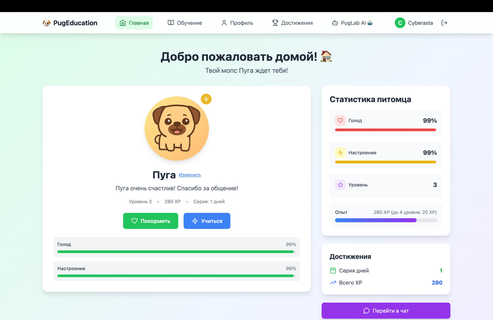
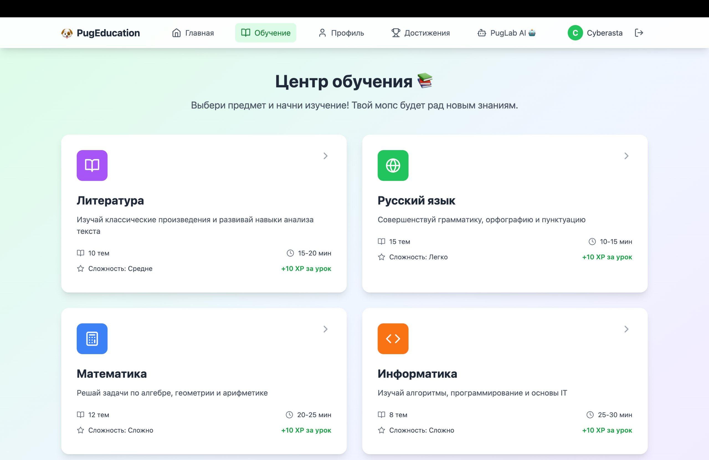
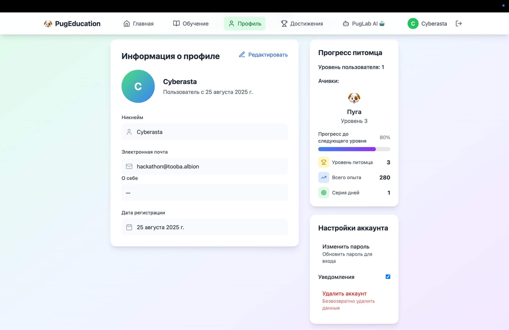
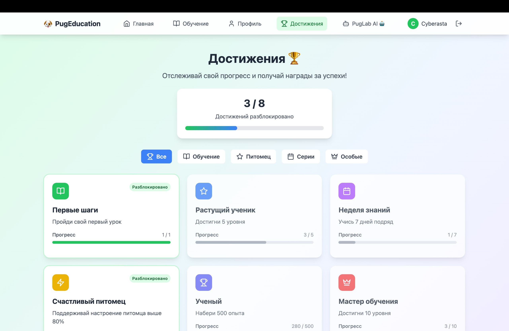
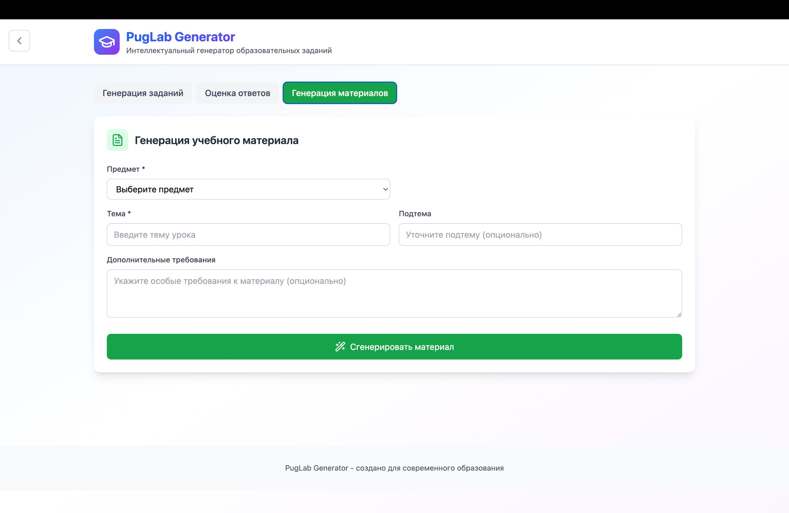

# 📚 Проект — Полное руководство (от А до Я)

Добро пожаловать! Это удобное и структурированное руководство по репозиторию. Оно содержит краткие, практичные инструкции для разработки, установки и запуска на macOS/Linux и Windows.

🏆 Проект создан для VibeHackathon (Tooba), трек 3 — "Education".

Команда: **Cyberasta**

## 🧭 Оглавление

- [📘 Введение](#intro)
- [🗂 Структура репозитория](#structure)
- [⚙️ Требования и установка](#requirements)
- [▶️ Быстрый старт (локально)](#quick-start)
- [🛠️ Скрипты запуска](#scripts)
- [🐞 Советы по отладке и тестированию](#debug)
- [❗ Частые проблемы и решения](#issues)
- [📷 Скриншоты и описание интерфейсов](#screenshots)

---

## <a id="intro"></a> 📘 Введение

Репозиторий содержит несколько подпроектов: `cards`, `main` (backend) и `tasks`. Каждый модуль имеет собственные зависимости и конфигурацию (например, `package.json` или `requirements.txt`).

Цель этого README — помочь быстро настроить окружение и одновременно предоставить ясные шаги для запуска всех модулей разработческой среды.

---

## <a id="structure"></a> 🗂 Структура репозитория (вкратце)

- `cards/` — фронтенд (Vite + React + TypeScript)
- `main/` — содержит бэкенд в `main/backend/` (Python) и фронтенд в `main/src`
- `tasks/` — фронтенд модуль с генераторами и системой оценки
- `run_all_mac.sh` — скрипт для macOS / Linux
- `run_all_windows.bat` — скрипт для Windows (cmd)

---

## <a id="requirements"></a> ⚙️ Требования и установка

Коротко: Node.js (рекомендуется LTS >=18), npm, Python 3.8+.

- Git — https://git-scm.com/
- Node.js — https://nodejs.org/
- Python 3 — https://www.python.org/downloads/

Рекомендуется использовать nvm (macOS/Linux) или nvm-windows на Windows и виртуальные окружения Python (`venv`).

Примеры команд (macOS/Linux, zsh/bash):

```bash
# установить зависимости фронтендов
cd cards && npm install && cd -
cd tasks && npm install && cd -

# создать и активировать виртуenv для backend
cd main/backend
python -m venv .venv
source .venv/bin/activate
pip install --upgrade pip
pip install -r requirements.txt
cd -
```

Windows (cmd.exe) — аналогично, но с путями Windows и активацией `.venv\Scripts\activate.bat`.

## 🧠 Ollama (локальные LLM)

Проект поддерживает локальные LLM через Ollama. В репозитории настроена кастомная модель `NicoleShelterV1` — приложение ожидает именно такое имя модели. Если вы хотите использовать свою модель, обычно достаточно переименовать вашу LLM в `NicoleShelterV1` (или изменить имя модели в конфигурации приложения, если вы знаете где оно задаётся).

Краткая инструкция по установке и запуску Ollama:

- macOS (рекомендуется, zsh):

```bash
# установить через Homebrew
brew install ollama
# запустить сервер Ollama (можно запускать из любого каталога)
ollama serve
# установить LLM (в отдельном терминале)
ollama pull <ссылка на LLM, имя которой должно быть NicoleShelterV1>
```

- Linux:

```bash
# на Linux можно установить Ollama через curl или следовать официальной инструкции для вашей дистрибуции
curl -fsSL https://ollama.com/install.sh | sh
# запустить сервер Ollama (можно запускать из любого каталога)
ollama serve
# установить LLM (в отдельном терминале)
ollama pull <ссылка на LLM, имя которой должно быть NicoleShelterV1>
```

- Windows:

"Ollama" предоставляет инсталляторы/инструкции на официальном сайте; на Windows удобно использовать WSL и инструкции для Linux, либо установить через официальный установщик. После установки команда `ollama serve` также доступна и её можно запускать из любого пути.

Замечания:
- Команда `ollama serve` запускает локальный сервис Ollama и её можно запускать из любого рабочего каталога — она не зависит от текущего пути в терминале.
- Если у вас есть готовый бандл модели, поместите/импортируйте его согласно документации Ollama и убедитесь, что модель доступна под именем `NicoleShelterV1`.

Если хотите, могу добавить в репозиторий конкретные шаги для импорта вашей модели (укажите формат модели и откуда вы её берёте).

---

## <a id="quick-start"></a> ▶️ Быстрый старт (локально)

В корне репозитория выполните (macOS/Linux):

```bash
chmod +x ./run_all_mac.sh
./run_all_mac.sh
```

На Windows откройте `run_all_windows.bat` или выполните его из командной строки.

Скрипты попытаются установить зависимости для `cards` и `tasks`, создать виртуальное окружение для `main/backend` и запустить сервисы в dev-режиме.

---

## <a id="scripts"></a> 🛠️ Скрипты

- `run_all_mac.sh` — установка зависимостей и параллельный запуск dev-серверов (macOS/Linux)
- `run_all_windows.bat` — аналог для Windows (cmd)

Если нужна более гибкая оркестрация, рассмотрите `concurrently`, `pm2` или `docker-compose`.

---

## <a id="debug"></a> 🐞 Советы по отладке

- Проверяйте логи терминалов и вывод dev-серверов.
- Для фоновых процессов на macOS используйте `ps aux | grep node` и `ps aux | grep python`.
- Если фронтенд не собирается, зайдите в соответствующую папку и запустите `npm run dev` вручную.
- Для backend: убедитесь, что виртуальное окружение активно и установлены зависимости.

---

## <a id="issues"></a> ❗ Частые проблемы и решения

---

## <a id="screenshots"></a> 📷 Скриншоты и описание интерфейсов

- Главная страница
		
	Краткое описание: здесь отображается основной дашборд, быстрые действия пользователя и текущая статистика.

- Карточки предметов
		
	Краткое описание: список предметов с прогрессом и переходом к занятиям/теории.

- Профиль
		
	Краткое описание: информация о пользователе, настройки и персональные данные.

- Достижения
		
	Краткое описание: система бейджей и прогресс-лента достижений.

- Кастомные занятия (tasks)
		
	Краткое описание модуля `tasks/`: он генерирует персонализированные задания и оценивает ответы (см. папку `tasks/` в репозитории для реализации: компоненты `TaskGenerator`, `MaterialGenerator`, `AnswerEvaluator`, и сервисы `taskService`, `evaluationService`).

---

- "npm: command not found" — установите Node.js и npm, добавьте в PATH.
- "python: command not found" — установите Python 3 и добавьте в PATH.
- Нет прав на запуск shell-скрипта — выполните `chmod +x run_all_mac.sh`.

---

Спасибо за использование проекта — успехов в обучении!
